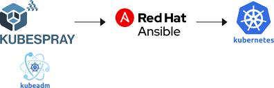

kubespray k8s cluster

{width="4.616666666666666in"
height="1.479861111111111in"}

- **Minimum required version of Kubernetes is v1.22**

- **Ansible v2.11+, Jinja 2.11+ and python-netaddr is installed on the
    machine that will run Ansible commands**

- The target servers must have **access to the Internet** in order to
    pull docker images.

- The target servers are configured to allow **IPv4 forwarding**.

- If using IPv6 for pods and services, the target servers are
    configured to allow **IPv6 forwarding**.

- The **firewalls are not managed**, you\'ll need to implement your
    own rules the way you used to. in order to avoid any issue during
    deployment you should disable your firewall.

- If kubespray is run from non-root user account, correct privilege
    escalation method should be configured in the target servers. Then
    the ansible_become flag or command parameters \--become or -b should
    be specified.

[Minimum Hardware prerequisite]{.smallcaps}

- Master

  - Memory: 1500 MB

- Node

  - Memory: 1024 MB

- In this tutorial I will be setting a simple k8s cluster ( 1 master
    node and 2 worker nodes )

- I will be using calico as networking solution and a **stacked etcd**
    (master and etcd in the same machine )

- I'll will be using **ngnix** as **internal load balancer** (default
    setup)

- Kubespray come with **containerd** as default **container runtime**

- We need an ansible controller to run our playbook from in my case I
    will be using the a separate machine that will act as ansible
    controller

- We need a privileged user , For this tutorial I will be running
    everything as root

- K8s version is latest by default v24.2

VMs setup :

- 3 Nodes Virtual Machines

- OS : Centos 7.9

- 2 GB ram

- 2 CPU

- Hard disk: 20GB available

# *CNAME FQDN*

**Controller.medianet Controller.medianet.test**

**Master1.medianet Master1.medianet.test**

**worker1.medianet worker1.medianet.test**

**worker2.medianet worker2.medianet.test**

1/Install Python : Ansible needs python to be installed on all the
machines.

````
yum update

yum install python

````
2/ Enalbe IPv4 forwarding by uncommenting the following line
````
echo \"net.ipv4.ip_forward=1\" \>\> /etc/sysctl.conf
````
3/ Disable Swap
````
swapoff -a
````
4/ Setup password less SSH between ansible controller and kubernetes
nodes
````
ssh-keygen -t rsa \"controller node\"
````
5/ Copy over the public key to all nodes.
````
ssh-copy-id master1.medianet

ssh-copy-id worker1.medianet

ssh-copy-id worker2.medianet
````
6/ Setup kubespray \"clone the official repository\"
````
git clone <https://github.com/kubernetes-incubator/kubespray.git>

cd kubespray
````
7/ Install Prerequisites "for ansible controller node only "
````
sudo yum install python3-pip -y
````

\*\*install:

ansible 2.11

ansible-core==2.12

cryptography==3.4 \"encrypts variables and files\"

jinja2==2.11 \"simple template files that store variables that can
change from time to time\"

netaddr==0.7 \"network address manipulation library \"

"also can be installed with requirements file "

8/ Set Remote User for Ansible

Add the following section in ansible.cfg file
````
remote_user="privilioged_user"
````
9/ Create Inventory
````
cp -rfp inventory/sample inventory/prod
````
10/ edit Inventory
````
file: inventory/prod/inventory.init

\[all\]

master1.medianet ansible_host=192.168.126.174 ip=192.168.126.174

worker1.medianet ansible_host=192.168.126.178 ip=192.168.126.178

worker2.medianet ansible_host=192.168.126.175 ip=192.168.126.175

\# \[bastion\]

\# bastion ansible_host=x.x.x.x ansible_user=some_user

\[kube_control_plane\]

master1.medianet

\[etcd\]

master1.medianet

\[kube_node\]

worker1.medianet

worker2.medianet

\[calico_rr\]

\[k8s_cluster:children\]

kube_control_plane

kube_node

calico_rr
````
11/ run ansible-playbook
````
ansible-playbook -b -v -i inventory/prod/inventory.ini cluster.yml -
````
etcd will be throwing some errors because we have only 2 etcd nodes so
either we add another etcd node or just add an extra args " -**e
ignore_assert_errors=yes "**

\## other command :
````
ansible-playbook -i inventory/prod/inventory.ini \--become \\

\--user=user \--become-user=root cluster.yml \\

\--extra-vars \"ansible_sudo_pass=PASSWORD\" \\
````
Option -i = Inventory file path

Option -b = Become as root user

Option -v = Give verbose output

12/ setup kubectl permissions
````
mkdir -p \$HOME/.kube

sudo cp -i /etc/kubernetes/admin.conf \$HOME/.kube/config
````
13 / remove cluster
````
ansible-playbook -i inventory/prod/inventory.ini reset.yml -b -v \\

\--extra-vars
\"master1.medianet,master2.medianet,master3.medianet,worker1.medianet\"
\\

-e reset_nodes=false \\

\--extra-vars \"ansible_sudo_pass=PASSWORD\"
````
